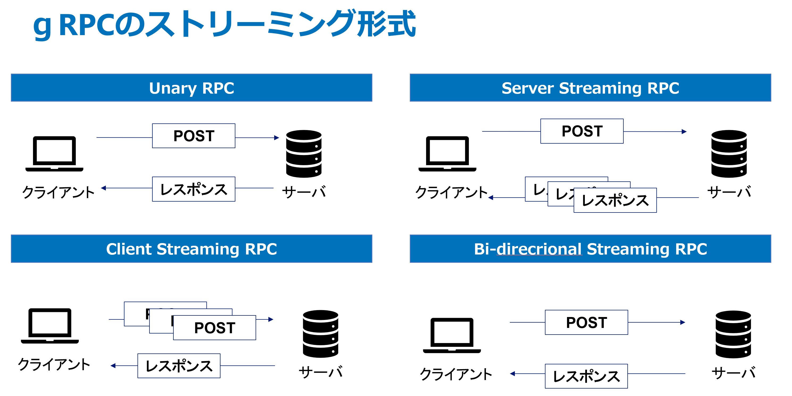
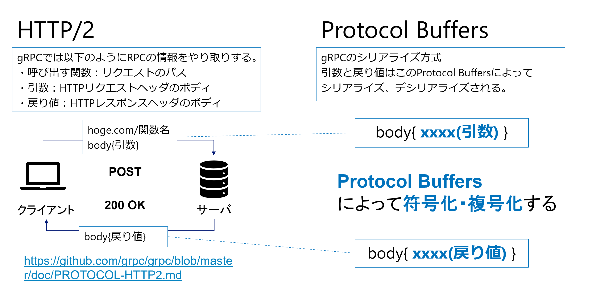
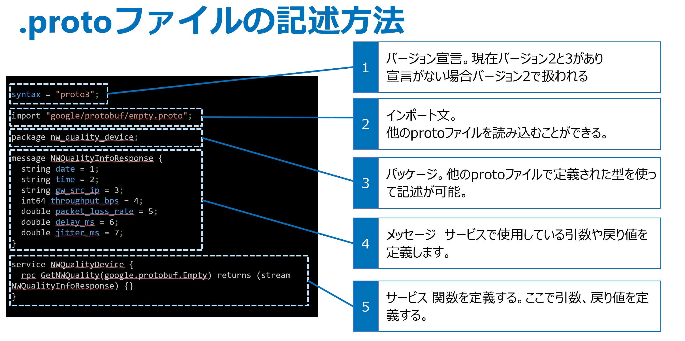
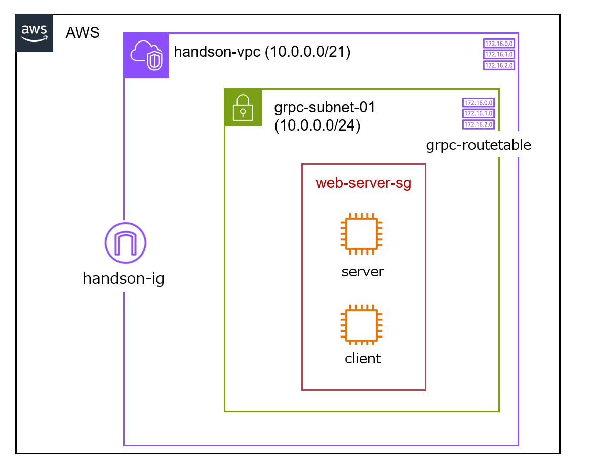

# gRPCとは
gRPCとはオープンソースのRPC(:Remote Producer Call)フレームワークです。
RPCはその名前の通り別のコンピュータの関数を呼び出したりすることを指します。
gRPCを使うことで、REST APIのように、アプリケーション間の通信を実装することができます。

# gRPCのメリット
- ストリーミング処理の実装 
    - (例)位置情報を定期的にずっとサーバからクライアントに送り続ける
    - (例)ネットワーク品質をずっと送り続ける \
    (参考画像)


- protocol bufferによるボディの圧縮
    - https://github.com/grpc/grpc/blob/master/doc/PROTOCOL-HTTP2.md
    - 

- protoファイルによるIFの定義
    - クライアント、サーバで別々で開発するときに非常に便利。
    - protoファイルがドキュメントとして機能する。
    - (参考画像)


# 実際構築してみる

Cloudformationテンプレートを構築します。

以下のようにserver用のEC2とクライアント用のEC2が構築されます。


ではサーバクライアントを作成してみましょう！

# サーバの構築

serverのEC2にSSMします。

bashに変更
```shell
bash
```

ホームディレクトリに移動
```shell
cd ~
```

gRPCハンズオン用のディレクトリを作成
```shell
mkdir grpc-handson
```

grpc-handsonに移動
```shell
cd grpc-handson
```

protoファイルを作成
```shell
vi grpc-handson-hello.proto
```

```proto
syntax = "proto3";

package hello;

service HelloWorld {
    rpc SayHello (HelloRequest) returns (HelloReply) {}
}

message HelloRequest {
    string name = 1;
}

message HelloReply {
    string message = 1;
}
```

このprotoファイルで作成しようとしている関数は以下


- protoファイルでは関数をserviceと呼ぶ
- 構造体としてメッセージを定義して自由に作成して使える
- stringやintなど一般的な型は事前に定義されている。(通信を節約したいときはできるだけプリミティブな型を使う。)


pip3をインストール
```shell
sudo dnf install -y python3-pip
```

grpcをインストール
```shell
pip install grpcio grpcio-tools
```
- grpcio PythonでgRPCを使用するのに必要なライブラリ
- grpcio-tools Pythonでprotoファイルのコンパイルができる。\
(protocを使う方法もあるが、こちらを活用する方がバージョン不一致などの不具合が少ない)

protoファイルをコンパイル
```shell
python -m grpc_tools.protoc -I. --python_out=. --grpc_python_out=. grpc-handson-hello.proto
```

生成されたファイルを確認
```shell
ll
```

grpc_handson_hello_pb2_grpc.py grpc_handson_hello_pb2.py が作成される。
```shell
[ssm-user@ip-10-0-0-245 grpc-handson]$ ll
total 16
-rw-rw-r--. 1 ssm-user ssm-user  210 Oct 28 06:31 grpc-handson-hello.proto
-rw-rw-r--. 1 ssm-user ssm-user 1652 Oct 28 06:31 grpc_handson_hello_pb2.py
-rw-rw-r--. 1 ssm-user ssm-user 3474 Oct 28 06:31 grpc_handson_hello_pb2_grpc.py
```

gRPCではこれらの作成されたファイルの中身を意識しなくても実装が可能 \
サーバの実装を行う

```shell
vi grpc-server.py
```

```python
from concurrent import futures
import grpc
import grpc_handson_hello_pb2
import grpc_handson_hello_pb2_grpc

class HelloWorld(grpc_handson_hello_pb2_grpc.HelloWorldServicer): # サービスの中の関数の中でどのような()処理を行うか定義
    def SayHello(self, request, context):
        print(f"受信: {request.name}")
        message = "Hello, %s!" % request.name
        print(f"送信: {message}")
        return grpc_handson_hello_pb2.HelloReply(message=message)
    
def serve():
    server = grpc.server(futures.ThreadPoolExecutor(max_workers=10)) # gRPCのserverインスタンスを作成し、最大スレッド数を設定
    grpc_handson_hello_pb2_grpc.add_HelloWorldServicer_to_server(HelloWorld(), server) # サーバーにサービス（HelloWorldクラスのインスタンス）を追加
    server.add_insecure_port('[::]:8000') # 待ち受けポートの設定
    server.start() # サーバの処理を開始
    server.wait_for_termination() # サーバーが終了するまで待機

if __name__ == '__main__':
    serve()

```

サーバを実行します
```shell
python3 grpc-server.py
```

# クライアントの構築
クライアントにSSMします。

bashに変更
```shell
bash
```

ホームディレクトリに移動
```shell
cd ~
```

gRPCハンズオン用のディレクトリを作成
```shell
mkdir grpc-handson
```

grpc-handsonに移動
```shell
cd grpc-handson
```

protoファイルを作成
```shell
vi grpc-handson-hello.proto
```

```proto
syntax = "proto3";

package hello;

service HelloWorld {
    rpc SayHello (HelloRequest) returns (HelloReply) {}
}

message HelloRequest {
    string name = 1;
}

message HelloReply {
    string message = 1;
}
```

このprotoファイルで作成しようとしている関数は以下


- protoファイルでは関数をserviceと呼ぶ
- 構造体としてメッセージを定義して自由に作成して使える
- stringやintなど一般的な型は事前に定義されている。(通信を節約したいときはできるだけプリミティブな型を使う。)


pip3をインストール
```shell
sudo dnf install -y python3-pip
```

grpcをインストール
```shell
pip install grpcio grpcio-tools
```
- grpcio PythonでgRPCを使用するのに必要なライブラリ
- grpcio-tools Pythonでprotoファイルのコンパイルができる。\
(protocを使う方法もあるが、こちらを活用する方がバージョン不一致などの不具合が少ない)

protoファイルをコンパイル
```shell
python3 -m grpc_tools.protoc -I. --python_out=. --grpc_python_out=. grpc-handson-hello.proto
```

生成されたファイルを確認
```shell
ll
```

```shell
[ssm-user@ip-10-0-0-13 grpc-handson]$ ll
total 16
-rw-rw-r--. 1 ssm-user ssm-user  210 Oct 28 06:31 grpc-handson-hello.proto
-rw-rw-r--. 1 ssm-user ssm-user 1652 Oct 28 06:31 grpc_handson_hello_pb2.py
-rw-rw-r--. 1 ssm-user ssm-user 3474 Oct 28 06:31 grpc_handson_hello_pb2_grpc.py
```

client用のpythonスクリプトを作成

```shell
vi grpc-client.py
```


```python
import grpc
import grpc_handson_hello_pb2
import grpc_handson_hello_pb2_grpc

your_name = input("あなたの名前を入力してください。サーバに送信します。\n")

def run():
    with grpc.insecure_channel('サーバのプライベートIPアドレス:8000') as channel:
        stub = grpc_handson_hello_pb2_grpc.HelloWorldStub(channel)
        print(f"送信：{your_name}")
        response = stub.SayHello(grpc_handson_hello_pb2.HelloRequest(name=your_name))
    print(f"受信：{response.message}")

if __name__ == '__main__':
    run()
```

```shell
python3 grpc-client.py
```